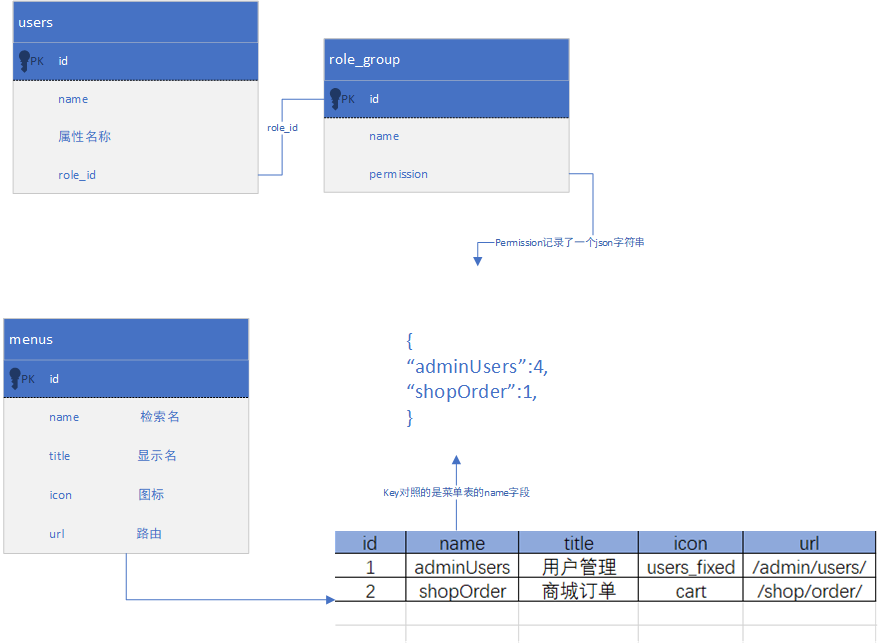

# django：设计一个权限系统
::: tip 为啥不用django自带的权限系统？
- django的权限系统缺乏对通一个权限的分级处理功能，如果要实现这个功能，需要设置很多冗长的权限表。
- 比如：对于订单业务，有些员工需要查看，有些需要能编辑，有些又需要审核退款（删除）权限。
:::


## 核心思路
1. 改造用户表`users`，添加role_id字段，用以标识角色。
2. 添加一个权限表`role_group`，用以记录各个角色的实际权限。
3. 添加一个菜单表`menus`，用以映射权限。
4. 权限分级：用`0表示无权限`，`1表示可读`，`2表示可增加`，`3表示可修改`，`4表示可删除`，你还可以按照这个思路设计跟多的值。这样，如果一个菜单，某个角色的权限为4，那么他实际上是可以拥有小于等于4的全部权限。


## 表设计



### users 表
#### role_id 字段
- 用以关联role_group表。


### role_group 表
#### permission 字段
- 这里可以看到，我用了一个json字符串来存储菜单权限，为啥这样做？当然是方便以后扩展非菜单权限（就是不在菜单中显示，但是实际程序代码中又要控制的权限），或者是别的前期想不到的地方。


### menus 表
#### name 字段
1. 用来在后端和前端的代码中，检索相应的权限而用的名字。
   这样就可以写一个后端装饰器方法：
   ```python
   @permission('adminUsers', 4)
   def delete_user(data):
       '''删除用户'''
       pass
   ```
   在装饰器方法中，我们就可以去检查用户所指向的role_group.permission字段里是否有`adminUsers>=4`了，如果否，就抛出403错误给前端。

2. 当然也可以写一个前端装饰器方法：
   ```js
   @permission('adminUsers', 4)
   function delete_user(id){
       ajax.delete('/api/users',{id:id}).then(res=>{
           console.log('删除成功')
       })
   }
   ``` 

3. 前端菜单显示的地方，就直接过滤掉权`限值==0`的菜单。
4. 前端重点按钮也可以根据这个值而决定是否显示或者`disabled`
   

#### icon 字段
- 用以给前端展示菜单图标


#### url 字段
- 用来处理前端/后端路由